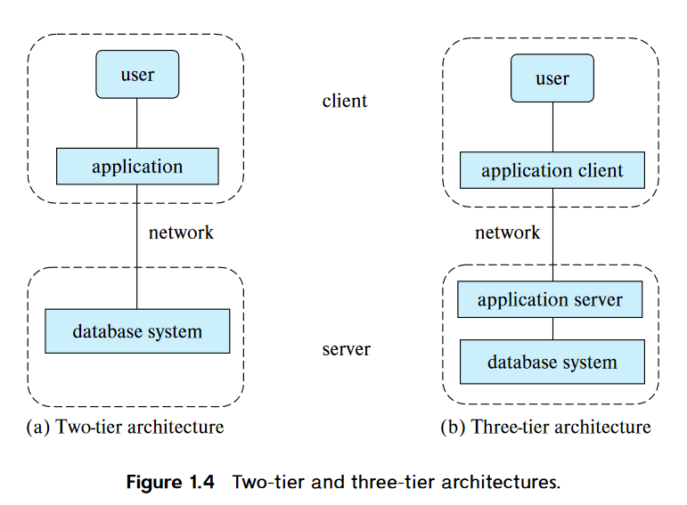

# Introduction

# Chapter 1 - Introduction

DBMS - Database-management system
 - collection of interrelated data and a set of programs to access those data
 - primary goal:
    - convenient and efficient way to store and retrieve db info

## Database-System Applications
 - DB systems are used to manage collection of data that:
    - valuable
    - large
    - accessed my multiple users at the same time
 - Key to managing complexity is **abstraction**
    - users and application programmers does not need to know underlying details of how the data is actually stored 
 - There are 2 modes in which DBs are used:
    1. to support online transaction processing
    2. to support data analytics

## Purpose of Database System
 - Major disadvantage of using typical file-processing system (suported by the OS)
    1. Data redundancy and inconsistency
    2. Difficulty in accessing data
    3. Data isolation
    4. Integrity problems
    5. Atomicity problems
    6. Concurrent-access anomalies 
    7. Security problems
 - DB systems offer solution for all these problems

## View of Data
 - What is DB
    - "A collection of interrelated data and a set of progrmas that allows users to access and modify these data"
    - provides abstract view of the data

 - 4 Categories of Data Models
    1. Relational Model
    2. Entity-Relationship Model
    3. Semi-structured Data Model
    4. Object-Based Data Model

## Data Abstraction
 1. Physical level
    - lowest level of abstraction
    - describes *how* the data are actually stored
 2. Logical level
    - describes *what* data are stored
    - relationships among those data
    - describe the entire DB in terms of a small number of relatively simple structures
        - does not need to know the complex physical-level structures -> **physical data independence**
    - each record is described by a type definition
        - interrelationship of these record types is also defined at this level
 3. View level
    - describes only part of the entire DB
        - hides logical level details
        - security -> only allows access to certain parts
    - simplifies interactoin with the system
    - several views are defiend

 - DB programmers != DB Administrators
    - DB Admins may be aware of certain details of the physical organization of the data
    - DB use data structure called an *index* to support efficient retrieval of records

 - These abstractions not only hide low level implementations from the users, but also the application program developers

 - **instance**: The collection of information stored in the DB at a particular moment
 - **schema**: The overall design of the DB
 - DB systems have several schemas for each level of abstraction
    - Physical schema
        - describes the DB design at the physical level
        - can be changed without affecting application program
    - Logical schema
    - View schema (aka subschemas)
 - Good and bad schema designs ? (ch 7)

## Database Languages
 - **DDL**(data-definition language)
    - specify the DB schema
    - special type of DDL -> data storage and definition language
        - used to specify the storage sturcture and access methods
    - DDL provides facilities to specify constraints
        - Domain Constraints
            - domain of possible values
        - Referential Integrity
        - Authorization
            - read, insert, update, delete
    - DDL -> output
        - "The output of the DDL is placed in the **data dictionary**, which contains metadata - that is data about data"
 - **DML**(data-manipulation language)
    - express DB quereis and updates
    - 2 types:
        1. Procedural DMLs
        2. Declarative DMLs (nonprocedural DMLs)
    - **query** is a statement requesting the retrieval of information

 - SQL language -> nonprocedural (Declarative)
    - a query takes as input several tables and always returns a single table

 - ODBC (Open Database Connectivity)
    - defines appolication program interfaces for use with several programming language
    - JDBC (Java Database Connectivity)

## Database Design
 1. Initial Phase
    - characterize fuly the data needs of the prospective DB users
 2. Conceptual-design phase
    - choosese a data model and translates into a conceptual shcema of the DB
 3. Logical design phase
    - moving from the abstract data model to the implementation of the DB
 4. Physical design phase
    - physical features of the db are specified
    - for of file organization and the internal storage structure

## DB Engine
 - The functional components of a db system can be broadly divided into:
    1. storage manager 
        - manage how information stored on disks as low-level data 
            - how they move between disk storage and main memory
        - use the file system to store data
        - translates DML statements into low-level file-system commands
        - Components
            - Authorization and integrity manager
            - Transaction manager **?**
            - File manager
            - Buffer manager
        - Data structures it implements
            - Data files
            - Data dictionary
            - Indicies
    2. query processor
        - translates query language from logical level to sequence of operations at the physical level
        - components
            - DDL interpreter
            - DML compiler
                - performs query optimization
            - Query evaluation engine
    3. transaction management
        - treat a sequence of db accesses **atomically**
            - happen in its entirety or not at all
            - all-or-none requirement -> **atomicity**
        - correctness requirement -> **consistency**
        - persistence requirement -> **durability**
        - allows devs to think at a higher level
        - transaction -> a collection of operations that performs a single logical function in a db application
            - each transaction is a unhit of both atomicity and consistency
        - components
            - recovery manager
            - concurrency-control manager

## Database and Application Architecture

### two-teir and three-tier architecture

 - Rather than distributing the business logic of the application to all clients, it is better to embed in the application server only.
 - three-teir architecuter provides better security as well as performance

## History of DB systems
 - 1950s
    - magnetic tapes
    - data could be only read **sequentially**
 - 1960s
    - hard disks cam out
    - allowed direct access to data -> free from sequentiality
 - 1970s~1980s
    - Initially existing network and hierarchial DB was much better
    - System R -> efficient relational DB system
        - Soon Ingres, Oracle, DB2, etc... came out 
    - In 1980s relational model almost replaced the existing network and heirarchial DB model
 - 1990s
    - SQL language was designed -> to support query intensive applications
    - until 1980s, applications were mostly update-intensive
    - WWW came out
 - 2000s
    - semi-structured data
        - XML, JSON
    - added support for spatial data (location)
    - social network -> graph DB
    - need for rapid development -> NoSQL systems
 - 2010s
    - NoSQL systems evolved to provide features to support stricter notions of consistency
    - Enterprise started outsorcing data storage and management
    - cloud services
    - "software as a service"
