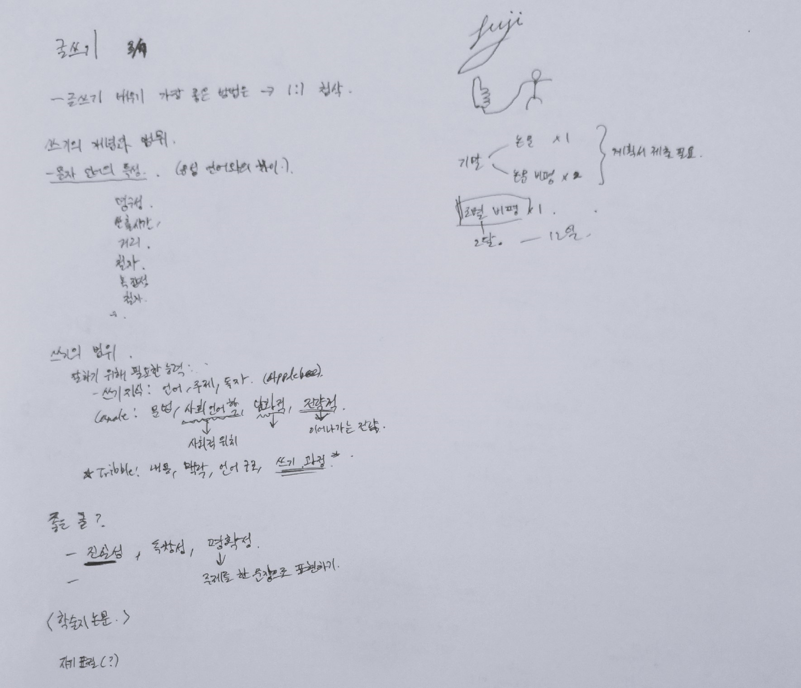
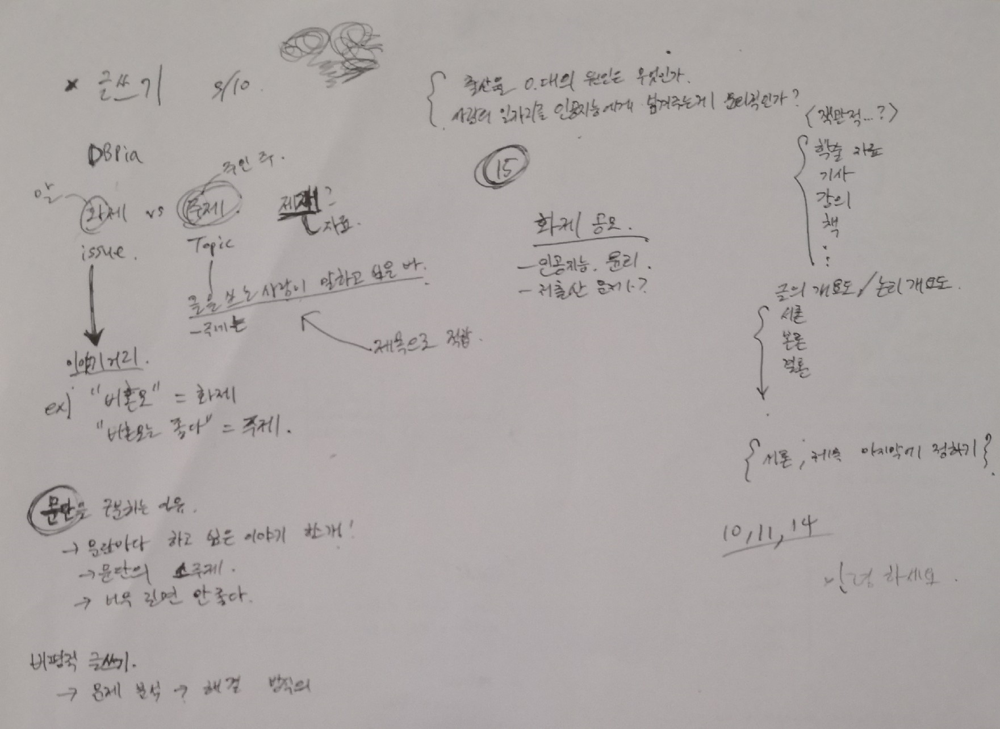

# Week 2

비평문 6팀:
 - 권은혁(21900050)
 - 최예라(22200750)

## 비평문?
 - 평가하는 글

## 과학 비평문 (Scientific Critique)
 - 평론 -> 평가 대상의 가치를 매김
 - 본인의 시각에서 객관적으로 평가 (evaluate)
    - Q 본인의 시각이면서 객관적이다.. ?
 - 궁극적 목표
    - 현재의 지식체계와 사회를 발전시키는 기여도를 기준으로 평가
    - 쉽게 써서 대중들에게 효과적으로 전달

## 과학 비평문의 종류
 - 수필적
    - 전체 내용 보다는 1,2가지 중점되는 소재나 주제
    - 자유롭다 -> 주관적 견해 포함
    - 대중에게 전달 목적
 - 논증적
    - 전체적으로 분석함으로 가치나 한계를 종합적으로 지적
    - 논거를 제시해 가면서
    - '머리말-본문-맺음말'의 형태
    - 객관성 확보

## 준비
 1. "비평하고자 하는 과학 분야의 정보를 가능한 많이 수집"
 2. "비평을 할 과학적 대상이 주어지면, 먼저 그 대상을 자세히 분석하여 무엇이 중요하나지를 파악하고, 그 가운데 구체적으로 어떤 것을 비평 대상으로 삼을 것인지를 정해야 한다"
 3. "수강을 하고 있는 특정 교과목에서 비평과제를 부여하면서그에 대한 비평 지침을 미리 알려 주는 경우에는 이 비평 지침을 염두에 두고 비평 대상물을 분석해야 한다"
 4. "비평 대상이 되는 책이나 자료를 읽을 때는 적절하게 메모를 하는 것이 필요하다"

## 과정
 1. "창조적이고 비판적으로 자료를 읽고 분석하기"
    - 핵심적인 주장 찾기
    - 뒷받침 하는 증거의 설득력
    - 내용 연결성
    - 오류
    - 육하원칙 질문하면서 분석 (Who, When, Where, What, hoW, Why)
 2. "필자가 주장하는 바를 뒷받침하는 데이터나 사실을 확인해 보기"
 3. "데이터와 자료의 내용을 요약하고 메모하기"
 4. "비평 대상의 가치를 평가하기"
    - 이론적이고 객관적인 자료에 근거해서 가치가 있는지 없는지 평가
    - Q: 어떤 가치? 어떤 관점으로서의 가치를 말하는 것인가?
 5. "비평문을 작성하기 위한 기획서 만들기"
    - ~설계도
    - 기획서에 들어갈 요소들:
        - "비평문을 쓰기 위한 대상 선정"
        - "비평문의 주제 및 개요 작성"
        - "비평문 쓰기를 위한 자료의 수집"
        - "자료의 분석 및 비평"
        - "비평문의 프레임(frame) 만들기"
            - 논리 개요도
                - 서론-본론-결론
        - 초안(first draft) 쓰기
        - 교정하기
            - 내용면에서의 교정
            - 구성면에서의 교정
            - 표현면에서의 교정

## 비평문의 일반적 형식과 내용

### 들머리 (Introduction)

### 본문 (Main body)

### 마무리 (Conclusion)

## 3/7 (Tue)

 - 글쓰기 배우기 가장 좋은 방법은 -> 1:1 첨삭
 - 쓰기의 개념과 범위
   - 문자 언어의 특성 (음성 언어와의 차이)
      - 영구성, 산출시간, 거리, 철자, 복잡성, 어휘, 형식성
 - 쓰기의 범위
   - 잘하기 위해 필요한 능력
      - 쓰기 지식: 언어, 주제, 독자 (AppleBee)
      - Canale: 문법, 사회언어학 (사회적 위치), 담화적, 전략적 (이어나가는 전략)
      - Tribble: 내용, 맥학, 언어 구조, 쓰기 과정
 - 좋은 글이란
   - 진실성, 독창성, 명확성

 - **자기 표절** (self-plagiarism) by ChatGPT
   - 이미 출판된 자신의 논문이나 연구 보고서 등에서 발표한 내용을 다시 사용하는 것
   - 동일한 내용을 2번 이상 사용하여 출판하거나 발표하는 것
   - 학술 연구에서는 용인되지 않는다
      - 중복 발표하여 독자나 평가자를 속이는 것으로 간주
      - 연구의 발전을 방해 (?)
   - 사용하기 위해서는 출처를 명확하게 밝혀야 함

## 질문
 - 비평문을 비평 (?)

## 3/10 (Fri)

### Lecture Note 요약
 - 화제 vs 주제
   - 화제 -> 이야기 거리
   - 주제 -> 글을 쓰는 사람이 말하고 싶은 바
   - Example
      - "비혼모" = 화제
      - "비혼모는 좋다" = 주제

 - 문단을 구분하는 이유
   - 문단마다 하고 싶은 이야기 한개 -> 소주제
   - 너무 길면 안좋다

 - 비평적 글쓰기
   - 문제 분석 -> 해결 방식 제안하는 식으로 쓸 수도 있다

 - 서론과 제목은 마지막에 쓰는 것이 좋다

 - 논리 개요도
   - 서론
   - 본론
   - 결론

 - 강의 책의 Chapter 15읽어보기

### Chapter 15 - 과학 에세이 쓰기 전략
 - 과학 에세이 (Scientific essay) = 과학적 내용을 에세이 형식으로 쓴 글
 - 과학적 사실을 대중에게 알리고 공감대를 형성하는 목적

 - 주제 정하기
   - 가치의 문제
      - 독자의 흥미
      - 사회발전에 도움이 될 만한 것
   - 내용의 문제
      - 주제에 대해 새롭고 분명한 식견을 가지기
      - 정확하고 새로운 자료
      - 창의적 해결책
   - 구체화의 문제
      - 글의 분량
      - 내용을 구체적이고 자세하게 쓸 수 있도록 주제를 좁혀서 잡기

 - 생각을 정리하고 자료 모으기
   - 내용 만들기
      - 관찰하고 분석한 내용을 바탕으로 넣을 내용을 생각대로 써 보는것
      - 순서에 상관하지 않고 적기
      - 각 내용마다 기호로 표시 (eg. (1), (2), ...)
      - 논리 개요도를 작성하는데 도움
      - 적절한 예가 있으면 같이 쓰기
      - 근거가 불확실한 것은 '?' 표시하기
   - 제재 -> 에세이를 쓰는 데 필요한 자료
      - 사건, 사실, 물건, 실례, 통계자료
      - 전문가들의 견해
      - 제재 선정
         - 주제를 뒷받침
         - 풍부하고 다양하고 새로운 것
         - 출처가 분명
         - 독자들의 관심을 끌 수 있는 것
         - 사실과 견해를 구분
 - 논리 개요도 작성하기
   - 3단 구성
      - 서론-본론-결론
   - 4단 구성
      - 기 승 전 결
   - 5단 구성
      - 문제제기 - 자신의 견해 - 반대 견해 - 반대 견해 논박 - 마무리
   - 개요도를 작성할 때 유의할 점
      - 소주제를 중심으로 노리 정연하게 작성
      - 논증의 요점이 잘 드러나도록
      - 소주제와 제재가 잘 호응이 되도록
      - 논리 개요도만 보아도 글의 전체 내용을 짐작할 수 있을 정도로
 - 초안 작성하기
   - 논리 개요도를 바탕으로 쓰기
   - 그렇지만 너무 얽매일 필요는 없다
   - 유의할 점
      - 컴퓨터로 작성
      - 자세하고 구체적으로
      - 앞 문장 혹을 앞 단락의 말꼬리를 놓치지 않도록 (자연스럽게)
      - 종합적으로 생각하면서
      - 보충할 부분은 표시하면서
      - 표준국어대사전 이용
      - 예정된 분량보다 좀 더 길게
      - 잘 안풀리면 조금 쉬었다가, 자리는 멀리 떠나지 않는다
      - **종결어미**
         - 평서형, 의문형, 명령형, 청유형, 감탄형
      - **비유법**
         - 직유법, 은유법, 풍유법, 의인법, 대유법
      - **강조법**
         - 영탄법, 열거법, 점층법, 대조법, 강조법
      - **변화법**
         - 도치법, 설의법, 대구법, 문답법, 반어법, 인용법
      - 정의, 예시, 비교, 대조, 일반화, 묘사, 분류, 분석, 등의 다양한 방법 쓰기
 - 들머리 잘 쓰는 법
   1. 글의 화제(Topic)을 미리 밝힘
   2. 글의 소재나 사건을 제시함
   3. 핵심용어나 낱말의 뜻을 규정함
   4. 화제가 되고 있는 말이나 일화를 소개함
   5. 글의 주제와 관련된 내용을 직접 제시함
 - 본문 쓰기를 잘하는 법
   1. 주제에 초점이 맞도록 해야 한다
   2. 화제의 내용과 범위에 맞도록 해야 한다
      - 분량 보다는 안목과 깊은 통찰력이 더 중요하다
   3. 단락 전개가 긴밀하게 되도록 해야 한다
   4. 새로운 인식에 따른 독창성 있는 내용을 담도록 해야 한다
   5. 그의 갈래에 따른 자연스러운 단락 전개가 되도록 해야 한다
   6. 글의 형식이 다양하고 리듬감이 있도록 해야 한다
 - 마무리 쓰기를 잘하는 법
   1. 본문 내용을 보충함으로써 마무리하기
   2. 본문을 요약하믕로써 마무리하기
   3. 제언이나 전망을 덧붙임으로써 마무리하기

 - 교정하기 
   -내용면, 구성면, 표현면으로 나누어 교정하고, 시간 간격을 두고서 해야 편견에서 벗어날 수 있다
   - 내용면
      1. 주제의 선명성
      2. 글 전체 내용의 통일성
      3. 제재의 타당성
      4. 내용의 창의성
   - 구성면
      1. 단락 나누기
         - 단락이 소 주제문을 중심으로 잘 나누어져 있는지
         - 뒤받침 문장들이 역할을 잘 하는지
      2. 단락간의 연결
         - 긴밀하고 자연스러운가? 
            - **긴밀하다**?
         - 동일어, 동의어, 지시어, 문장 접속어, 생략등의 단락을 엮어주는 요소
   - 표현면
      1. 어휘사용의 적절성
      2. 문장의 정확성
      3. 표현의 다양성
      4. 문체의 적절성
      5. 맞춤법 규정 준수
 - 제목 정하기
   - 너무 기계적 -> 흥미를 떨어뜨림
   - 너무 기교 부림 -> 글의 내용과 동 떨어짐
   - 주제를 잘 드러낼 수 있는 창의성 있는 제목
   - 제목은 글의 갈래에 따라 달라질 수 있다
      - 논증문, 설득문, 비평문, 설명문과 같이 주장이나 설명을 목적으로 하는 글 -> **명시적인 제목**
      - 묘사문, 서사문과 같은 느낌이나 감동을 전달하는 것을 목적으로 하는 글 -> **암시적인 제목**
         - 암시적인 제목의 예시 by ChatGPT
            - "끝없는 여정"
            - "시간의 칼날"
            - "길을 찾아서"
            - "저승사자의 초대"
            - "다시 돌아온 봄"
   - 제목의 다양한 면
      - 구조면 -> 단어 형태, 구절 형태, 문장 형태
      - 내용면 -> 글의 주제나 목적과 관련된 형태, 글의 제재와 관련된 형태
      - 표현면 -> 명시적인 형태, 암시적인 형태

## 그냥 새롭게 배운거
 - 학술지 vs 논문
   - Journal vs Paper
   - 학술지는 "여러 학문 분야에서 연구자들이 발표한 원고들이 심사를 거쳐 게시되는 학술적인 저널입니다" - ChatGPT
   - "논문은 이러한 학술지에 실리는 논문들을 일컫는 말로, 학술적인 연구 결과를 발표하고자 하는 글" - ChatGPT
   - "학술지는 여러 분야의 연구자들이 각자의 연구를 발표하고, 논문은 그 중에서도 하나의 연구 결과를 구체적으로 설명하는 글" - ChatGPT

## 주말에 할 일
 - **기말과제 예시 출력해서 읽어보기**
 - **팀으로 하는 비평문 후보 뽑아서 출력해서 읽어보기 & 팀원과 공유하기**