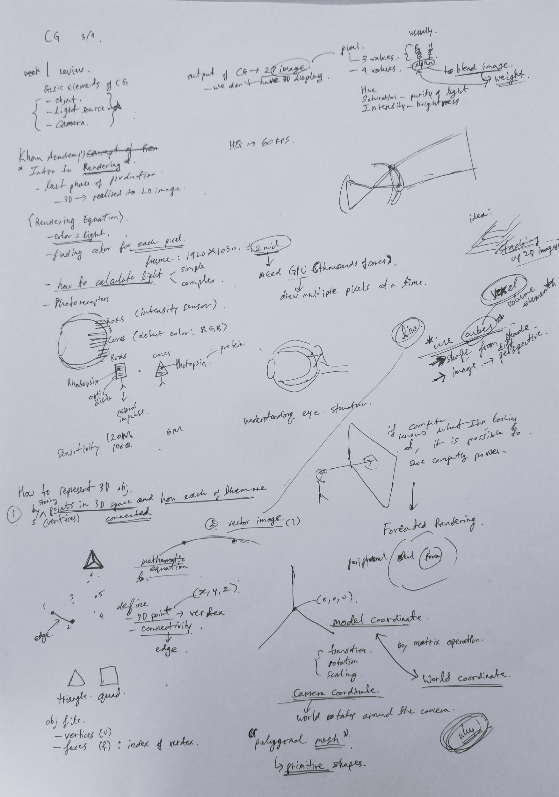

# Week 2

## 3/7 (Tue)

 - Week 1 review
    - Basic Elements of CG 
        - **Object**, **light source**, **camera**
    - Output of CG is 2D image
        - we don't have 3D display yet
 - Khan Academy's Intro to Rendering
    - last phase of production 
    - 3D -> realized to 2D image
    - color == light 
        - need to find color for each pixel
        - how to calculate light? 
            - simple
            - complex -> more realistic
    - How our Eyes work
        - Photoreceptors
            - Rods -> intensity sensor
            - Cones -> color sensor (RGB)
            - Rods and Cones have **Rhodopsin** in **optic disks** which converts light signal into neural impulse

 - How to represent 3D objects?
    - list of vertices and faces
    - voxel

 - New technology
    - Foveated rendering
        - This is technology that use less computational power for  rending locations that are not eye focused
        - This is similar to how we perseve real world through our eye

 - When rending the 3D scene and when transition, rotation, scaling happens, actually the camera stayus the same and 
 - peripheral | blurral | phobia  